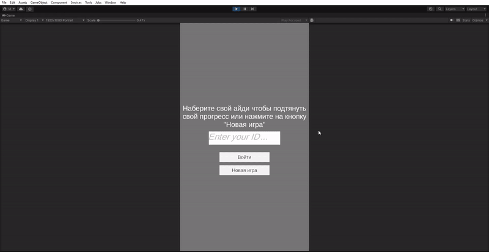

Данные сохраняются удаленно на сервере. Получить нужные данные можно по уникальной ID который выдается при создании "Новой Игры"

Видео можно посмотреть по этой ссылке - https://youtu.be/qeJjPf8Cidw
